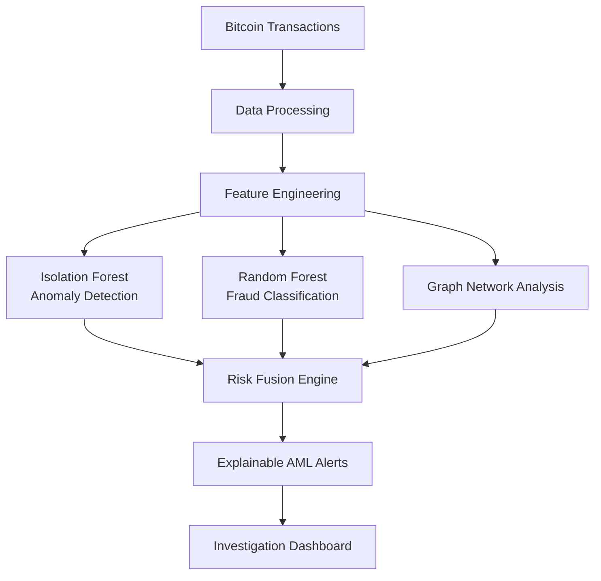

\

```markdown
# 🛡️ CryptoGuard AI | Anti-Money Laundering (AML) Detection Engine

       

## 📌 Overview
**CryptoGuard AI** is an end-to-end Machine Learning-based cryptocurrency fraud and Anti-Money Laundering (AML) detection system. Designed to mirror real-world financial monitoring architectures used by exchanges, the platform analyzes Bitcoin transaction behaviors, detects anomalies, generates risk scores, and provides explainable alerts via an interactive investigation dashboard.

Cryptocurrency transactions are fast, decentralized, and difficult to monitor manually. CryptoGuard AI addresses this by identifying suspicious transaction patterns using a combination of **Machine Learning, Behavioral Analytics,** and **Graph Network Intelligence**.

---

## 🏗️ System Architecture



---

## ✨ Core Features

### 1. Data Processing & Behavioral Feature Engineering

The pipeline ingests real-world Bitcoin transaction data, cleans features, and handles extreme class imbalances. It extracts critical behavioral signals to identify abnormal financial activity:

* Transaction velocity and frequency
* Night-time transaction activity
* High-volume amount indicators
* Transaction deviation patterns
* Network connectivity and hub behavior

### 2. Dual-Engine Machine Learning Models

* **Isolation Forest (Unsupervised):** Discovers unusual transaction patterns and detects novel, unknown fraud behaviors (zero-day anomalies).
* **Random Forest Classifier (Supervised):** Learns from labeled historical Bitcoin transactions to generate highly accurate fraud probability scores.

### 3. Graph-Based Transaction Intelligence

Since cryptocurrency transactions form complex networks, CryptoGuard AI leverages **NetworkX** to analyze Nodes, Edges, Degree, and Centrality. This helps identify suspicious clusters, highly connected illicit wallets, and abnormal fund flows.

### 4. Risk Fusion Engine

Multiple signals are mathematically fused into a single, actionable risk score:

> **Final Risk Score Formula:**
> `40% ML Fraud Probability` + `30% Anomaly Score` + `20% Graph Risk` + `10% Rule-Based Indicators`

### 5. Explainable AI (XAI) Alerts

The system does not act as a black box. Every flagged transaction includes an exact breakdown of *why* it was flagged, crucial for compliance and investigation.

**Example Output:**

> **Transaction ID:** TX12345
> **Risk Score:** 91/100 🔴 **HIGH RISK** | **Priority:** URGENT
> **Flagged Reasons:**
> ✓ High transaction amount anomaly
> ✓ Night transaction activity detected
> ✓ Suspicious network connection proximity

---

## 💻 Investigation Dashboard

Built with Streamlit, the dashboard provides a centralized view for compliance officers, featuring real-time transaction monitoring, risk distribution analytics, a prioritized suspicious transaction queue, and network graph visualizations.

---

## 📊 Dataset & Model Evaluation

* **Dataset:** Elliptic Bitcoin Transaction Dataset (contains transaction features, classes, and graph relationships mapping legitimate, illicit, and unknown nodes).
* **Evaluation Metrics:** Precision, Recall, F1-Score, and Confusion Matrix.
* *Note: The model is heavily optimized for **Recall** and **F1-Score**, as missing a suspicious transaction (False Negative) carries a higher regulatory and financial cost than a False Positive.*

---

## 🛠️ Technology Stack

| Category | Technologies Used |
| --- | --- |
| **Programming** | Python 3.10+ |
| **Data Processing** | Pandas, NumPy |
| **Machine Learning** | Scikit-learn (Random Forest, Isolation Forest) |
| **Graph Analytics** | NetworkX |
| **Visualization & UI** | Streamlit, Plotly, Matplotlib |
| **Version Control** | Git, GitHub |

---

## 📁 Project Structure

```text
CryptoGuard-AI-AML-Detection
│
├── data/
│   ├── raw/
│   └── processed/
├── notebooks/
├── src/
│   ├── feature_engineering.py
│   ├── fraud_model.py
│   ├── supervised_model.py
│   ├── graph_analysis.py
│   ├── risk_engine.py
│   └── final_risk_engine.py
├── models/
│   └── random_forest_fraud_model.pkl
├── dashboard/
│   └── app.py
├── docs/
│   └── screenshots/
├── requirements.txt
└── README.md

```

---

## 🚀 Installation & Usage

**1. Clone the repository and install dependencies:**

```bash
git clone [https://github.com/Rauof-Qadir/CryptoGuard-AI-AML-Detection.git](https://github.com/Rauof-Qadir/CryptoGuard-AI-AML-Detection.git)
cd CryptoGuard-AI-AML-Detection
pip install -r requirements.txt

```

**2. Launch the Streamlit Dashboard:**

```bash
streamlit run dashboard/app.py

```

*The dashboard will automatically open in your browser at `http://localhost:8501`.*

```

```