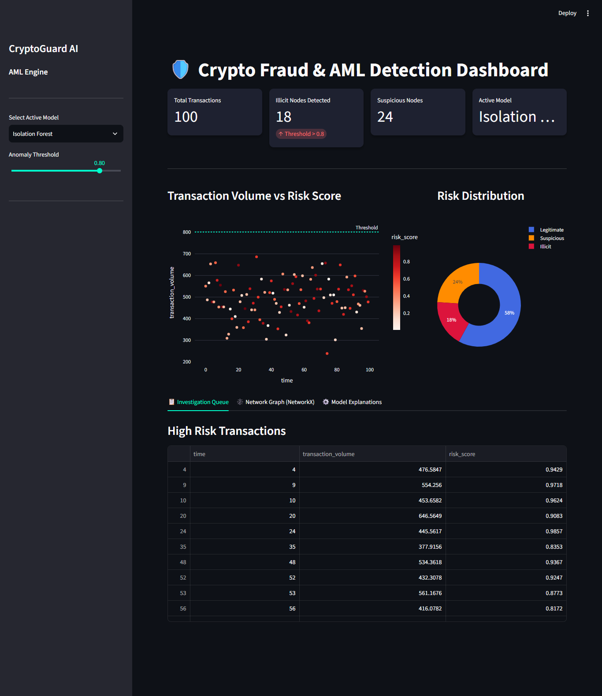
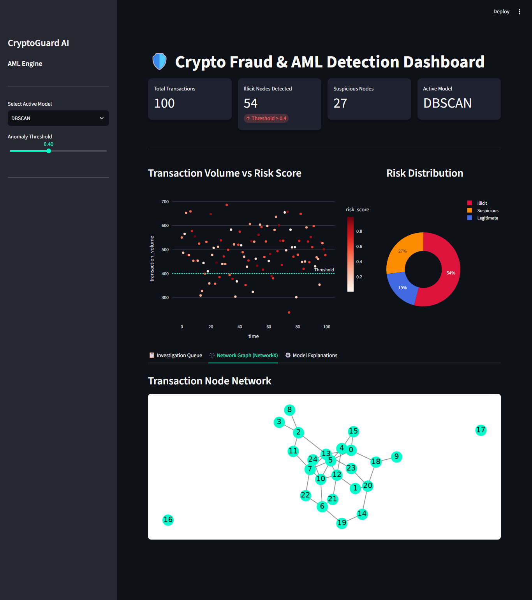
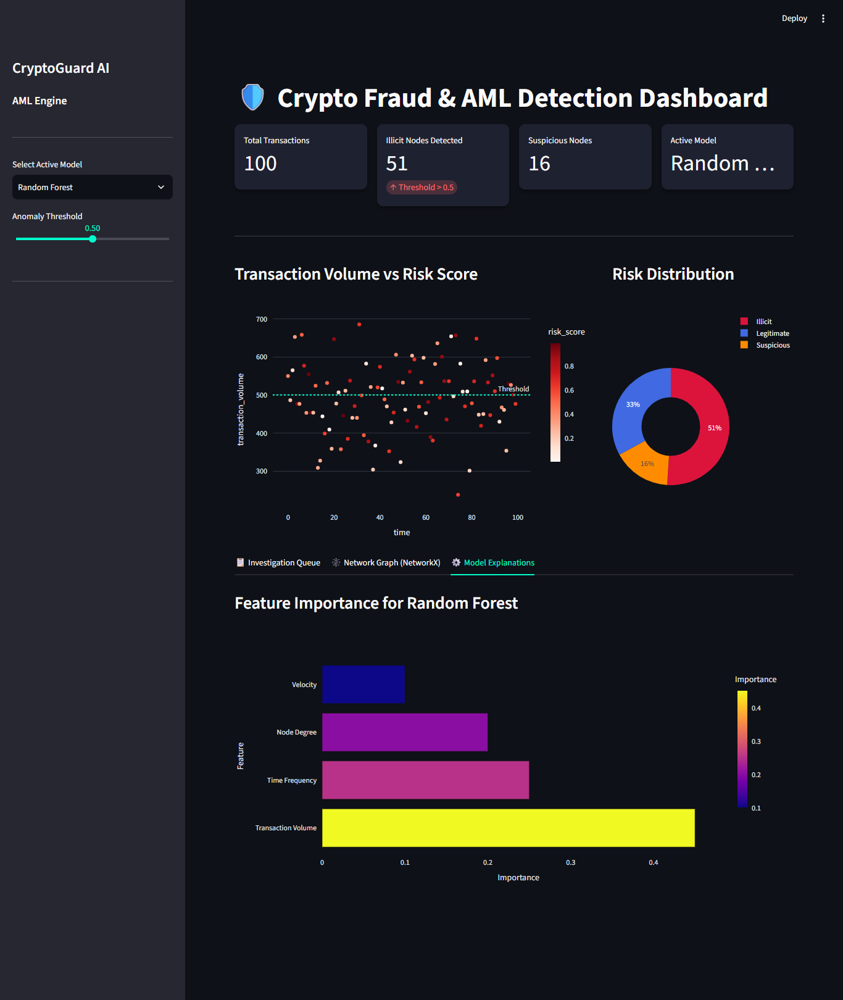
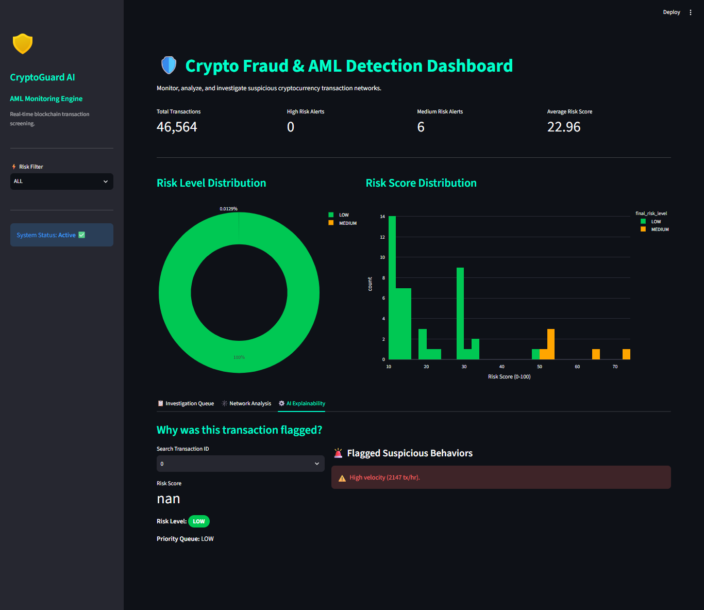

# 🛡️ CryptoGuard AI
# Crypto Fraud & Anti-Money Laundering (AML) Detection Engine


## Overview

CryptoGuard AI is an end-to-end Machine Learning based cryptocurrency fraud and Anti-Money Laundering (AML) detection system.

The project analyzes Bitcoin transaction behavior, detects suspicious activities, generates risk scores, explains why transactions are flagged, and provides an investigation dashboard similar to real-world financial monitoring systems used by exchanges and financial institutions.


## Project Objective

Cryptocurrency transactions are fast, decentralized, and difficult to monitor manually.

CryptoGuard AI aims to identify suspicious transaction patterns using:

- Machine Learning
- Anomaly Detection
- Behavioral Analytics
- Graph Network Intelligence
- Explainable Risk Scoring


---

 
 
 
 
 
# System Architecture

Bitcoin Transactions

    ↓

Data Processing

           ↓

Feature Engineering

           ↓

┌───────────────────────┐
│          │
           ↓

Isolation Forest Random Forest
Anomaly Detection Fraud Classification

│          │
└──────────┬────────────┘

        ↓

 Graph Network Analysis

        ↓

  Risk Fusion Engine

        ↓

 Explainable AML Alerts

        ↓

Investigation Dashboard


---

# Key Features


## 1. Data Processing Pipeline

- Loads real-world Bitcoin transaction data
- Cleans and prepares transaction features
- Handles labeled transaction classes
- Creates ML-ready datasets


## 2. Behavioral Feature Engineering

The system extracts transaction behavior signals:


- Transaction velocity
- Night transaction activity
- High amount indicators
- Transaction deviation patterns
- Network connectivity behavior


These features help identify abnormal financial activity.


---

## 3. Machine Learning Models


### Isolation Forest

Used for:

- Unsupervised anomaly detection
- Discovering unusual transaction patterns
- Detecting unknown fraud behaviors


### Random Forest Classifier

Used for:

- Supervised fraud prediction
- Learning from labeled Bitcoin transactions
- Generating fraud probability scores


---

# 4. Graph-Based Transaction Intelligence


Crypto transactions form networks.

CryptoGuard AI analyzes:

- Nodes
- Edges
- Degree
- Centrality
- Transaction connections


Graph analysis helps identify:

- Suspicious clusters
- Highly connected wallets
- Abnormal transaction networks


---

# 5. Risk Fusion Engine


Multiple signals are combined:


Final Risk Score =

40% ML Fraud Probability

30% Anomaly Detection Score

20% Graph Risk

10% Rule Based Indicators


Output:


Risk Score: 91/100

Risk Level: HIGH

Priority: URGENT


---

# 6. Explainable Fraud Detection


The system does not only say:

"Transaction is suspicious"


It explains:

Example:


Transaction ID:
TX12345

Risk Score:
91/100

Risk Level:
HIGH

Reasons:

✓ High transaction amount

✓ Night transaction activity

✓ Suspicious network connection

Priority:

URGENT


---

# 7. Investigation Dashboard


Built using Streamlit.


Dashboard provides:


- Transaction monitoring
- Risk distribution
- Suspicious transaction queue
- Network visualization
- Explainable alerts


---

# Dataset


## Elliptic Bitcoin Transaction Dataset


Source:

Elliptic Bitcoin transaction dataset containing:

- Transaction features
- Transaction classes
- Transaction graph relationships


Dataset contains:

- Legitimate transactions
- Illicit transactions
- Unknown transactions


---

# Technology Stack


## Programming

Python


## Data Processing

- Pandas
- NumPy


## Machine Learning

- Scikit-learn
- Random Forest
- Isolation Forest


## Graph Analysis

- NetworkX


## Visualization

- Matplotlib
- Plotly
- Streamlit


## Development

- Git
- GitHub
- Jupyter Notebook


---

# Project Structure


CryptoGuard-AI-AML-Detection

│
├── data
│ ├── raw
│ └── processed
│
├── notebooks
│
├── src
│ ├── feature_engineering.py
│ ├── fraud_model.py
│ ├── supervised_model.py
│ ├── graph_analysis.py
│ ├── risk_engine.py
│ └── final_risk_engine.py
│
├── models
│ └── random_forest_fraud_model.pkl
│
├── dashboard
│ └── app.py
│
├── docs
│
├── requirements.txt
│
└── README.md


---

# Model Evaluation


The project evaluates models using:


- Precision
- Recall
- F1 Score
- Confusion Matrix


Fraud detection focuses on recall and F1-score because missing suspicious transactions is costly in financial systems.


---

# Running the Project


## Install Dependencies


```bash
pip install -r requirements.txt
Run Dashboard
streamlit run dashboard/app.py

Dashboard opens:

http://localhost:8501